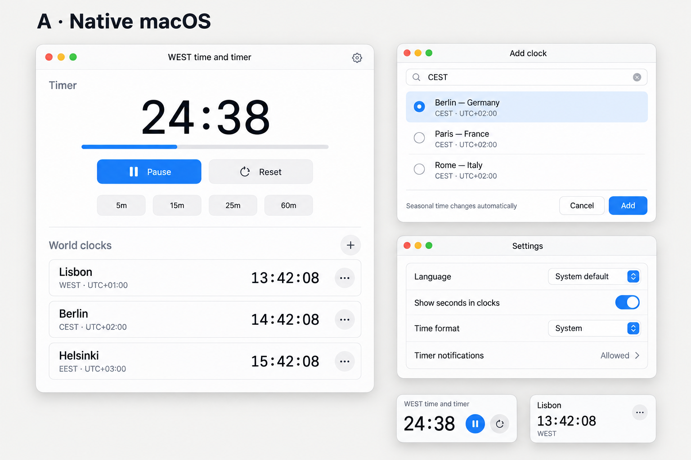
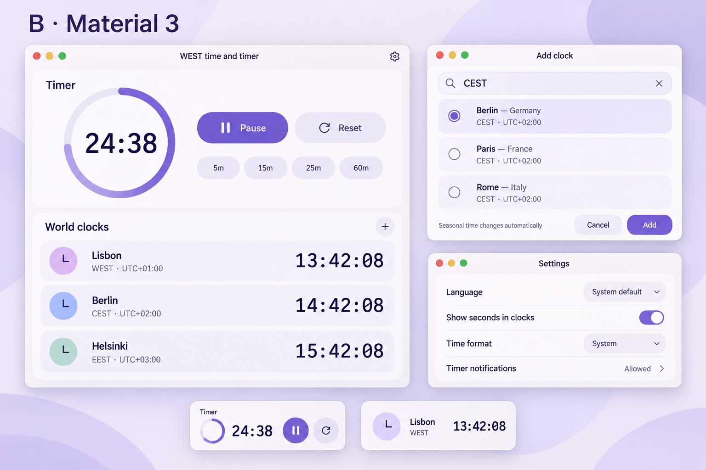
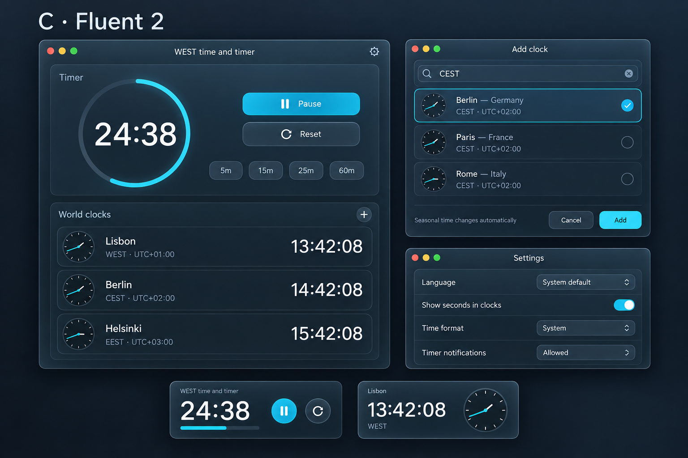
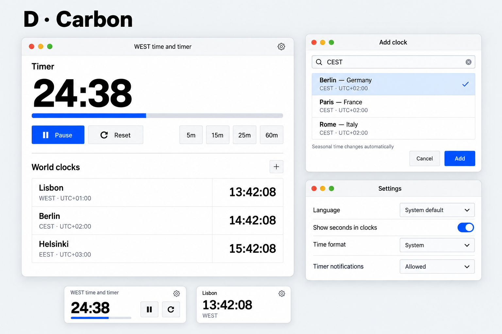

# Четыре варианта дизайна
Статус на 18 сентября 2026: **выбран B — Material 3**, только macOS desktop. Созданы встроенным imagegen, режим text-to-image. Это сгенерированные концепты, не скриншоты готового приложения и не сборка из официальных UI-kit-компонентов. Все изображения 1536 × 1024; [точные промпты](IMAGE_PROMPTS.md).

На каждом: главное окно с активным таймером и мировыми часами, добавление по CEST, настройки, два widget-preview. Английский используется для сопоставимости изображений; обязательные локализации перечислены в PLAN.md. Пресеты/длительность доступны для изменения до старта; на running-состоянии действуют правила плана.

| Вариант | Основа | Реализация и сложность |
|---|---|---|
| A | [Apple HIG](https://developer.apple.com/design/human-interface-guidelines/) и [Apple Design Resources](https://developer.apple.com/design/resources/) | Стандартные SwiftUI-контролы, SF Symbols, минимум кастомизации. Рекомендуется для простоты |
| B | [Material 3](https://m3.material.io/) | Мягкие карточки, фиолетовые акценты, кольцо; собственные SwiftUI-стили |
| C | [Fluent 2 materials](https://fluent2.microsoft.design/material) | Тёмные полупрозрачные поверхности и голубые акценты; нативная адаптация, без WinUI |
| D | [Carbon](https://carbondesignsystem.com/elements/themes/overview/) | Плотные строки, строгая сетка, синий акцент; собственные SwiftUI-стили |

## A — Native macOS

## B — Material 3

## C — Fluent 2

## D — Carbon

## Правила переноса в реализацию
Реализуется B средствами SwiftUI/SF Symbols с системной светлой/тёмной темой. Другие варианты сохранены для истории выбора, сторонний UI-фреймворк не нужен.

Геометрия реальных виджетов и тонирование определяются WidgetKit, превью ориентировочные. Аналоговые циферблаты в C и буквенные значки в B — декоративные детали генерации; их не требуется реализовывать. Статус уведомлений в C/D визуально похож на dropdown, но в приложении это статус и ссылка в системные настройки, а не управление системным разрешением. Часы остаются цифровыми. Уведомления, значения и время на изображениях демонстрационные.

Выбор B-material-soft.png записан в PROMPT.md. Новые требования имеют приоритет над изображением: отдельные записи городов и обозначений, 11 языков включая русский, large widget до шести часов с разницей относительно системного времени у каждой строки. Текущий PNG остаётся референсом стилистики и не является исчерпывающим макетом новых функций.
