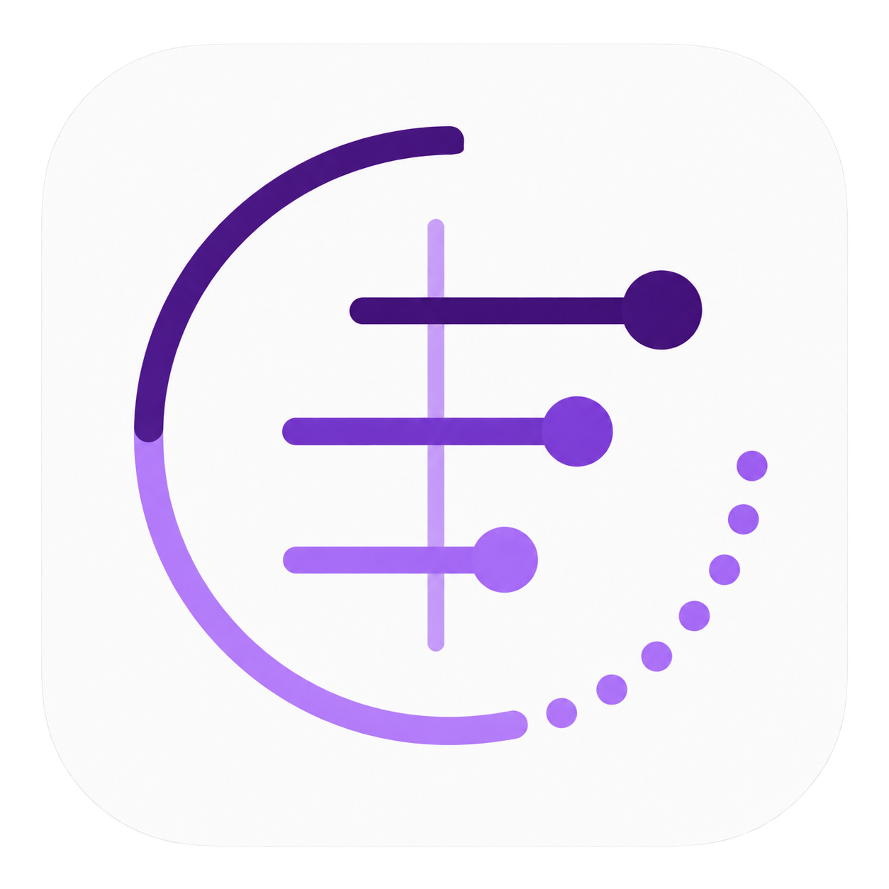

# WEST time and timer — final design set

## 1. Main screen

Status: **approved**.

Reference: [`MAIN-SCREEN-APPROVAL.md`](MAIN-SCREEN-APPROVAL.md).

## 2. Widget family

Status: **approved**.

Reference: [`WIDGET-APPROVAL.md`](WIDGET-APPROVAL.md).

## 3. App icon B — Offset Lines

Status: **approved and implemented**.

Reference: [`ICON-APPROVAL.md`](ICON-APPROVAL.md). The original selected B artwork is preserved; only its background changes to sRGB R/G/B `0.994`. The previous redrawn SVG is explicitly rejected.

The app bundle uses this corrected PNG as the source for `AppIcon.icns`; the rejected redrawn SVG is not used.
