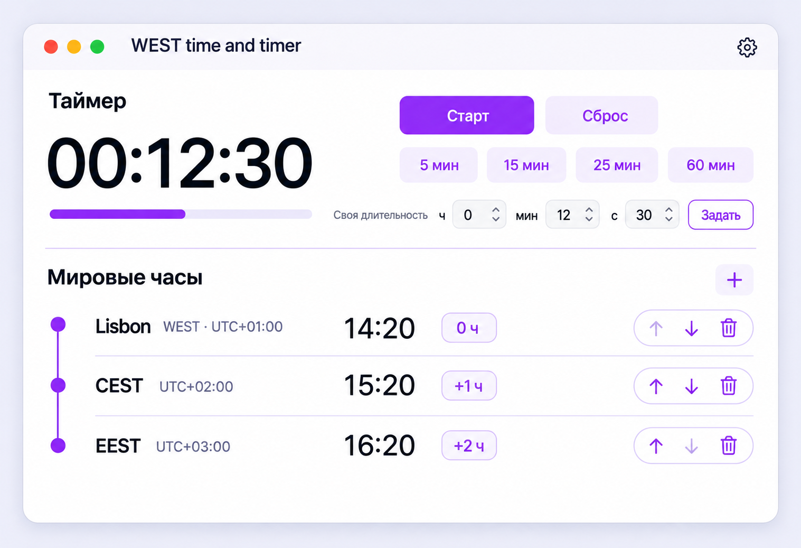
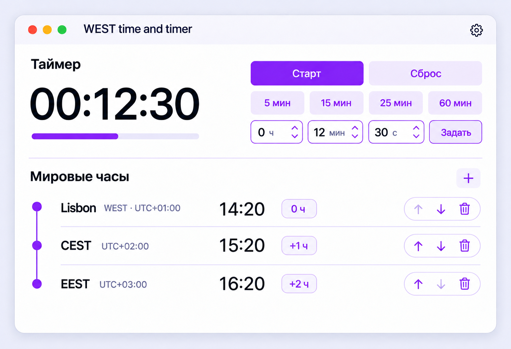

# Main screen approval candidate

Status: **approved as the final main-screen design on 19 September 2026 and implemented**. Created from the user's selected option-A palette and layout collage.

## Information hierarchy

1. **Timer / primary glance:** large tabular countdown in the upper-left.
2. **Timer / actions and input:** Start/Pause/Continue/Repeat and Reset in the upper-right; presets below; custom hour/minute/second input plus Apply stays visible on the third line.
3. **Progress:** a thin linear indicator under the large countdown, without a decorative ring.
4. **World clocks:** one fixed grid ordered identity → current time → difference from Mac → management.

## Layout contract

- Recommended content width: 760–900 pt; minimum supported width remains 520 pt with controlled compression.
- Window uses an 8 pt spacing system and 24 pt outer margins.
- Timer uses a 45/55 two-column grid. The large value never competes with input fields for the same column.
- Primary and secondary timer actions use 36 pt control height. Presets and custom inputs use at least 32 pt; hit targets expand to 44 pt without changing visual height.
- The custom input is always present. It is disabled while the timer runs or is paused, following the existing product rule; it is never removed from the layout.
- A single hairline divides the two functional sections.

## World-clock row contract

Each row uses the same four columns:

| Column | Content | Alignment |
|---|---|---|
| Identity | City or current seasonal abbreviation; abbreviation and UTC offset as metadata | leading |
| Time | Live tabular time | trailing within fixed column |
| Difference | `0 ч`, `+1 ч`, `+5 ч 30 мин` pill | leading/centered |
| Management | Up, down, delete in one capsule | trailing edge |

- Recommended row height: 72 pt, allowing six rows in the normal window with restrained vertical growth.
- The vertical timeline conveys order. Nodes align to each row's visual center.
- Separators run from the identity column through the management column. They do not form disconnected underlines beneath individual values.
- First-row Up and last-row Down remain in place with lower opacity, preventing the control group from shifting.
- The difference pill has a flexible minimum width so fractional differences do not clip.
- Long city names truncate only after metadata yields space; the current time and management controls remain stable.

## Visual tokens

- Canvas: warm white `#FCFBFF`.
- Surface: white `#FFFFFF`.
- Primary text: ink `#17131F`.
- Accent: violet `#8B2CF5`.
- Secondary fill: pale lavender `#F5EEFF`.
- Rules/borders: lavender `#DFC9FF`.
- No gradients in implementation, no glass material, and only the native window shadow.

## Responsive and accessibility behavior

- At narrow width, identity metadata moves beneath the primary identity within the same first column. The time, difference, and management order is preserved.
- RTL mirrors the geometry while preserving signed difference semantics and isolated Latin abbreviations.
- Controls receive localized accessibility labels; rows combine time-zone identity, time, UTC offset, and difference into one VoiceOver summary.
- Keyboard focus order follows visual order: timer action → reset → presets → custom input → apply → add clock → row management.

## Revision 2 — aligned custom duration controls

Status: **approved final revision**.

The timer control area is one fixed-width grid:

- Row 1: `Start` and `Reset`, two equal flexible columns.
- Row 2: 5/15/25/60-minute presets, four equal flexible columns.
- Row 3: hours, minutes, seconds, and `Apply`, four equal flexible columns.
- All rows share the same leading edge, trailing edge, and inter-column gap.
- Unit labels are inside their fields (`0 ч`, `12 мин`, `30 с`); no separate custom-duration label remains.
- Duration fields use a white surface, violet border and controls, ink values, and muted-violet units.
- `Apply` uses a regular button width and height equal to the other third-row controls.

Implementation grid ratios are `1fr 1fr`, then `1fr 1fr 1fr 1fr`, then `1fr 1fr 1fr 1fr`, with a consistent 12 pt gap. This remains stable across localization; fields have accessibility labels that do not rely on the visible abbreviated units.
