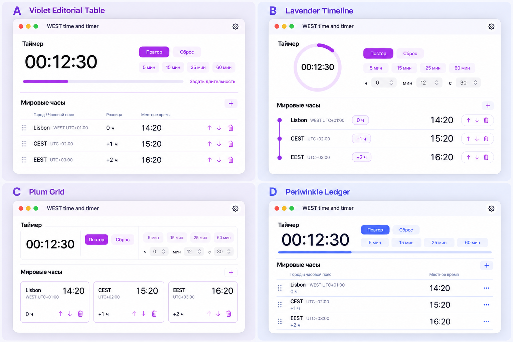
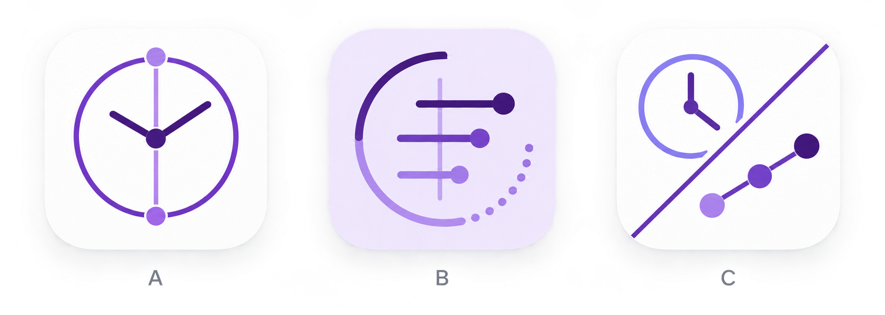
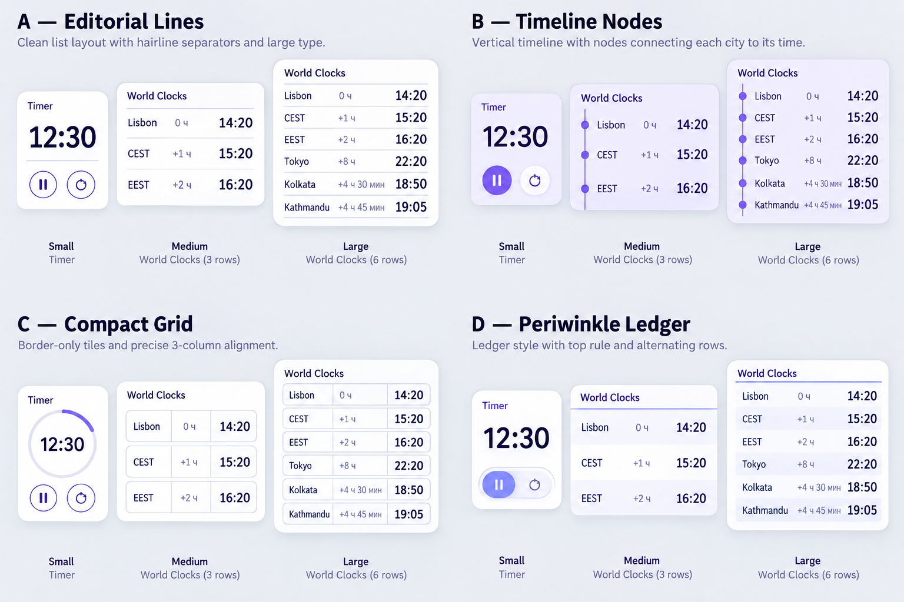

# Design proposals — 19 September 2026

Current consolidated selection: [WEST time and timer — final design set](FINAL-DESIGN-SET.md).

These are selection boards, not screenshots of implemented UI. They were generated with the built-in ImageGen tool from the existing app screenshot and the constraints below. The selected direction will be rebuilt as native SwiftUI/SF Symbols; generated pixels will not ship as UI.

## Main screen and world-clock layout

- **A — Violet Editorial Table:** compact aligned columns, a single action baseline, and a typographic timer with linear progress.
- **B — Lavender Timeline:** zone rows connected by a thin line, difference beside the city, and all actions in one trailing capsule.
- **C — Plum Grid:** border-only clock tiles; metadata and controls share one bottom baseline.
- **D — Periwinkle Ledger:** restrained table, difference grouped with the city, time in one dedicated column, drag handle plus one overflow action.

All four intentionally remove the current three-level stack of time, difference, and actions. The times shown are distinct: Lisbon 14:20, CEST 15:20, EEST 16:20.

## App icon

- **A — Meridian Ring:** world time and clock combined in one symmetric mark.
- **B — Offset Lines:** three time offsets inside a countdown arc.
- **C — Split Time:** clock and zone nodes divided diagonally.

After selection, the chosen mark should be redrawn deterministically and exported to the complete macOS icon set; this board itself is not the final app-icon asset.

## Widgets

Each family shows Timer small, World Clocks medium with three entries, and World Clocks large with six entries:

- **A — Editorial Lines**
- **B — Timeline Nodes**
- **C — Compact Grid**
- **D — Periwinkle Ledger**

The earlier comparison has been superseded by [the widget approval candidate](WIDGET-APPROVAL.md), derived from the approved main screen. The final WidgetKit views must still be tested at actual macOS widget sizes, with six rows, long names, RTL, seconds, and system tinting.

## Generation prompts

The prompts specified native macOS/SwiftUI proportions, white and purple palettes, simple geometric lines, the existing timer/world-clock scope, accurate distinct example times, and explicit exclusions for maps, analog clocks, extra product features, heavy shadows, gradients, glassmorphism, and mobile framing.
