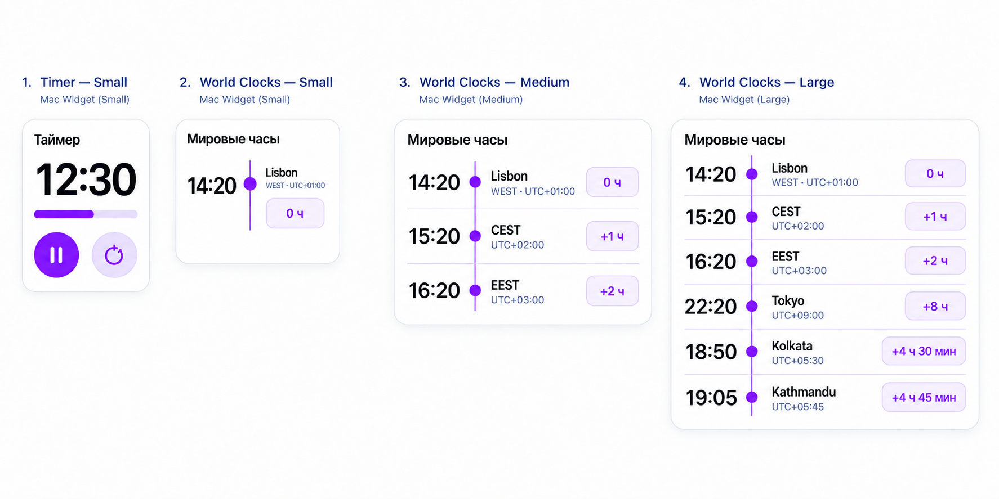
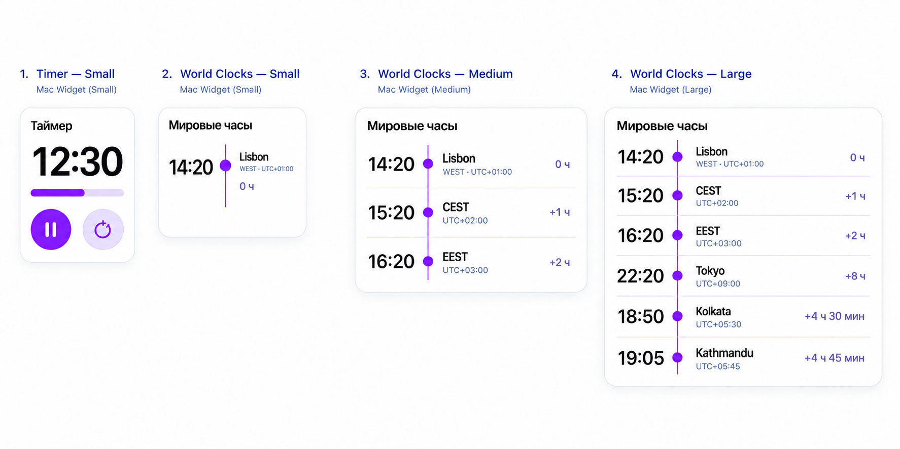

# Widget family approval candidate

Status: **approved on 19 September 2026 and implemented in the WidgetKit source**. Derived from the approved main-screen palette and the selected Timeline Nodes direction.

## Included families

1. Timer — `systemSmall`.
2. World Clocks — `systemSmall`, one saved entry.
3. World Clocks — `systemMedium`, up to three entries.
4. World Clocks — `systemLarge`, one to six entries.

## World-clock row contract

The reading order is fixed:

`current time → timeline node → city/designation and metadata → difference from Mac`

- Current time is the first, fixed-width tabular column.
- The violet rail separates time from identity and conveys list order.
- Identity shows the city or current seasonal abbreviation first, then current abbreviation/UTC offset as metadata.
- Difference is the trailing column and uses a flexible outline pill.
- Rows use hairline separators; there are no nested cards or management controls.
- All values describe one current instant and must use the saved IANA zone.

The small widget preserves the same semantic order but places its difference pill below the identity to fit the real square `systemSmall` canvas. Time remains left of the rail.

## Timer small

- Large bounded countdown.
- Thin linear progress bar matching the main screen.
- Pause/continue/start/repeat and reset use two equal App Intent buttons.
- White WidgetKit background; violet primary action and pale-lavender secondary action.

## Density and dynamic content

- Medium uses three rows; large uses six without scrolling or paging.
- Large reserves enough width for `+4 ч 45 мин` and enough time-column width for optional seconds such as `19:05:08`.
- When seconds are enabled, time typography may step down one size while row and column geometry remain fixed.
- Long names truncate metadata before primary identity; time and difference stay visible.
- A deleted configured record displays a missing-entry state and is not silently replaced.
- RTL mirrors the visual grid while preserving correct isolation for signed numbers and Latin abbreviations.
- WidgetKit system margins, tinting, Dynamic Type, and accessibility labels take priority over mockup pixels.

## Visual tokens

The family reuses the approved main screen:

- Background: white `#FFFFFF`.
- Text: ink `#17131F`.
- Accent and timeline: violet `#8B2CF5`.
- Secondary fill: pale lavender `#F5EEFF`.
- Rules/borders: lavender `#DFC9FF`.
- No gradients, glass material, or internal drop shadows.

## Revision 2 — quieter difference and stronger identity hierarchy

Status: **approved final revision**.

- Difference from Mac is plain trailing text on the white background; it has no border, fill, or pill silhouette.
- Difference uses a smaller medium-weight muted violet-gray style, so it remains readable without competing with time and identity.
- Primary city/designation stays bold.
- Seasonal abbreviation and UTC offset use regular weight at roughly 65–70% of the primary identity size and a muted cool gray-violet color.
- Column order and alignment remain unchanged: time → node → identity/metadata → difference.
